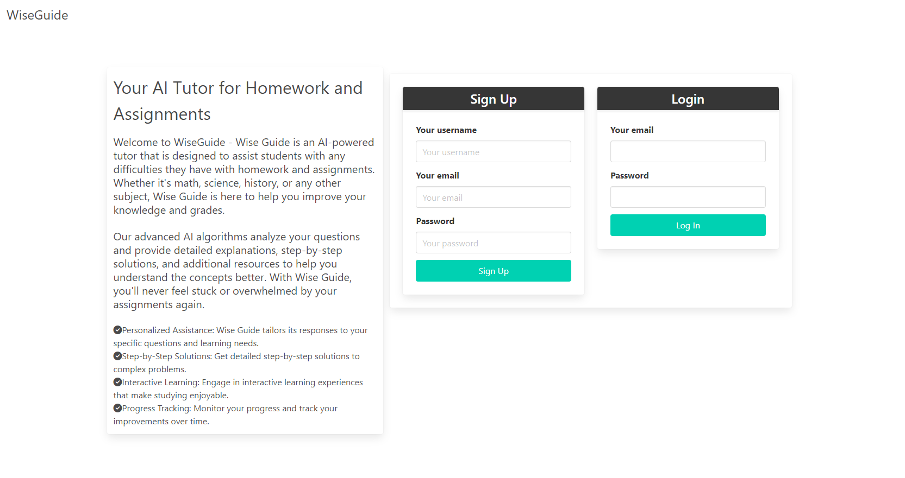
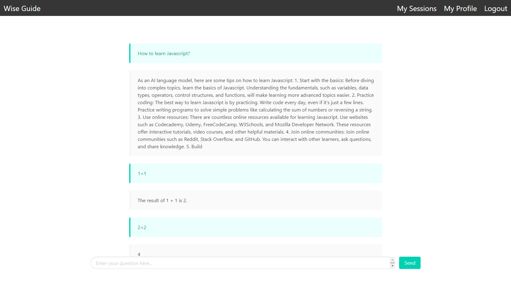

<!-- PROJECT LOGO -->
 

  

  <h3 align="center">Wise Guide</h3>

  

    Wise Guide: Personalized AI Tutoring Across a Wide Range of Subjects
  

<!-- TABLE OF CONTENTS -->

  
Table of Contents

  <ol>
    <li>
      <a href="#about-the-project">About The Project</a>
      <ul>
        <li><a href="#built-with">Built With</a></li>
      </ul>
    </li>
    <li>
      <a href="#getting-started">Getting Started</a>
    </li>
    <li><a href="#roadmap">Roadmap</a></li>
    <li><a href="#contributing">Contributing</a></li>
    <li><a href="#license">License</a></li>
    <li><a href="#contact">Contact</a></li>
    <li><a href="#acknowledgments">Acknowledgments</a></li>
  </ol>

<!-- ABOUT THE PROJECT -->

## About The Project

Wise Guide is an innovative web application that leverages artificial intelligence to provide personalized tutoring and assistance across a wide range of subjects for learners of all ages. Whether you're a student looking to improve your knowledge on specific subjects, or a lifelong learner aiming to consistently learn about new subjects, Wise Guide is here to assist you.

(<a href="#readme-top">back to top</a>)

### User Stories

#### User Story 1

AS a Student  
I WANT to be able to have a reliable source of information that can help me learn new things  
SO THAT I can improve my knowledge on required subjects for my school to improve my grades and understanding

#### User Story 2

AS a Learner  
I WANT to use a personal teaching assistant  
SO THAT I can consistently learn about new subjects

(<a href="#readme-top">back to top</a>)

### Built With

- [React](https://reactjs.org/)
- [GraphQL](https://graphql.org/)
- [Apollo Client](https://www.apollographql.com/docs/react/)
- [MongoDB](https://www.mongodb.com/)
- [Express.js](https://expressjs.com/)
- [JWT](https://jwt.io/)
- [Heroku](https://www.heroku.com/)

(<a href="#readme-top">back to top</a>)

<!-- GETTING STARTED -->

## Getting Started

[Deployed Website](https://wise-guide.herokuapp.com/)

(<a href="#readme-top">back to top</a>)

<!-- ROADMAP -->

## Roadmap

- [x] User login and account creation
- [x] Subscription model implementation
- [x] AI Assistant with question input and response
- [x] Lesson saving and review functionality
- [x] MERN Stack implementation
- [x] Quality README
- [x] Deployed to Heroku

(<a href="#readme-top">back to top</a>)

<!-- CONTRIBUTING -->

## Contributing

- Abdelrahman Ahmed
- Graham Synnott
- Sotirios Chortogiannos
- Yingge Hu

(<a href="#readme-top">back to top</a>)

<!-- LICENSE -->

## License

(<a href="#readme-top">back to top</a>)

<!-- CONTACT -->

## Contact

Repository

> [https://github.com/JABOWG/wise-guide/tree/main](https://github.com/JABOWG/wise-guide/tree/main)

---

Abdelrahman Ahmed

> [https://github.com/AbdelrahmanAhmed605](https://github.com/AbdelrahmanAhmed605)

---

Graham Synnott

> [https://github.com/GSynnott](https://github.com/GSynnott)

---

Sotirios Chortogiannos

> [https://github.com/sotiriosc](https://github.com/sotiriosc)

---

Yingge Hu

> [https://github.com/huyingg1](https://github.com/huyingg1)

---

(<a href="#readme-top">back to top</a>)

